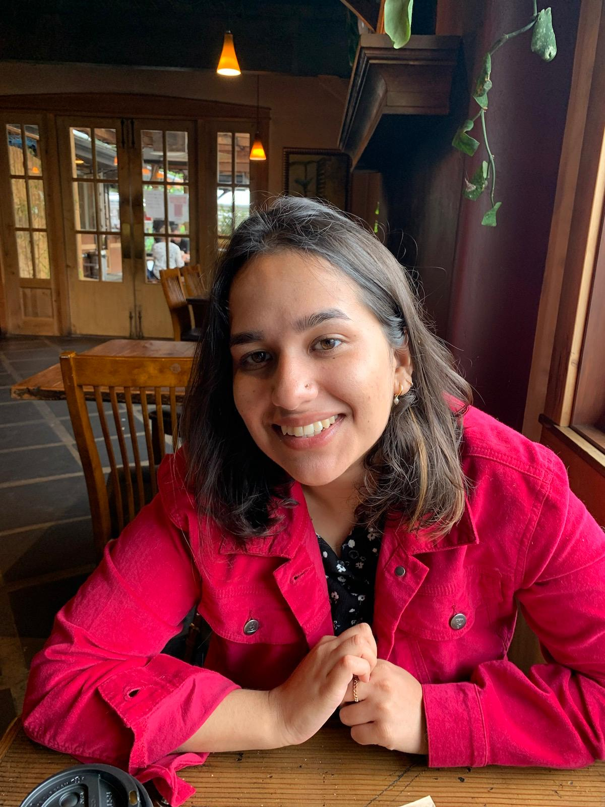

  

## About

I am a Postdoctoral Scholar in the [Computational Climate and Ocean Group](https://compclimate.github.io/ccog.github.io/) at UC Davis, working with [Dr. Maike Sonnewald](https://msonnewald.com). My research focuses on developing interpretable and trustworthy machine learning methods to understand and emulate ocean and climate dynamics across scales.

I received my Ph.D. in Mathematics from Washington University in St. Louis in 2025, advised by [Dr. Ari Stern](https://www.math.wustl.edu/~astern/). My doctoral work studied structure-preserving numerical integration and the stability of machine learning models, particularly through backward error analysis and functional equivariance. This foundation now informs my work on explainable AI for complex geophysical systems.

My current research lies at the intersection of machine learning, numerical analysis, and climate science. I am particularly interested in designing hybrid physics–AI models and interpretable emulators that improve our understanding of nonlinear ocean processes, extreme events, and long-term climate behavior.

**Research Interests:** Interpretable AI, ocean and climate dynamics, stability of neural networks, numerical analysis, hybrid physics–machine learning models.

My work aims to make machine learning models for climate science more transparent, reliable, and actionable for scientific discovery and decision-making.

 

📄 [Download my CV](academic_cv-3.pdf)  
📧 [sansuri@ucdavis.edu](mailto:sansuri@ucdavis.edu)

 

---

## Publications

S. Suri and M. Sonnewald (2026), *Trusting Machine Learning with Physics: A Fidelity Verification Framework for Neural Networks*, In Review.

A. Stern and S. Suri (2023), *Functional Equivariance and Modified Vector Fields*, *Journal of Computational Dynamics*, 11(4), 409–426.

D. Rim, S. Suri, S. Hong, K. Lee, R. J. LeVeque (2023), *A Stability Analysis of Neural Networks and Its Application to Tsunami Early Warning*, *Journal of Geophysical Research: Machine Learning and Computation*, 1(4).

M. Chamberland, S. Jing, S. Suri (2020), *A Generalization of the One-Seventh Ellipse*, *Mathematics Magazine*, 93(4), 271–275.

---

## Selected Talks and Presentations

- Poster: *Trusting Machine Learning with Physics*, Institute for Pure and Applied Mathematics (IPAM), UCLA  
- Invited Talk: *Functional Equivariance and Backward Error Analysis*, Missouri S&T Applied Mathematics Seminar  
- Invited Talk: SciCADE 2024, Minisymposium on Structure-Preserving Numerical Methods  
- Invited Talk: Midwest Numerical Analysis Day 2024  
- Workshop Participant: ICERM Hot Topics Workshop on Modeling and Learning with HPC  
- Poster Award (2nd Place): WashU Graduate Research Symposium (2024)

---

## News

- **2026:** Submitted work on machine learning fidelity and interpretability in physical systems 
- **2025:** Started Postdoctoral position at UC Davis in Computational Climate and Ocean Group
- **2024:** Featured in WashU Ampersand magazine for my research: [Math for a Changing World](https://artsci.washu.edu/ampersand/math-changing-world)
- **2024:** Delivered invited talks at SciCADE, Midwest Numerical Analysis Day and Missouri S&T Applied Mathematics Seminar
  
